<div style="text-align: right;">May 15</div>

# Assignment 1 - XM23p Loader and Memory

This document describes the design of an XM23p emulator's loader module.\
It reads the S-records from an XME file, and loads the result into the emulator's IMEM and DMEM.

## Data Dictionary
```
S_REC = 'S' + REC_TYPE + LENGTH + ADDRESS + DATA
REC_TYPE = ['0'|'1'|'2'|'9']
LENGTH = BYTE_PAIR
ADDRESS = 2{BYTE_PAIR}2
DATA = 1{BYTE_PAIR}30
BYTE_PAIR = 2{CHAR}2
CHAR = ['0'-'F']
```
## Design ##


### Main Program Flowchart ###


### Process Record Flowchart ###


### Display Memory Flowchart ###