# Assignment 2 - XM23P Instruction Pipeline

<div style="position: absolute; top: 0; right: 0;">Zachary Fraser</div>

This assignment aims to implement the instruction pipeline for an XM23P emulator.  
## Design
The design contains logic flowcharts detailing the CPU Loop, and the Fetch, Decode, and Execute Stages.  A Data dictionary describing the instructions and register file is also included.




<!-- Page Break -->
<div style="page-break-after: always;"></div>



<!-- Page Break -->
<div style="page-break-after: always;"></div>



<!-- Page Break -->
<div style="page-break-after: always;"></div>



<!-- Page Break -->
<div style="page-break-after: always;"></div>

**Data Dictionary**
``` 
INSTRUCTION     =   CODE + 1{PARAMETER}4
CODE            =   [0-20] *Contiguous encoding of instructions*
PARAMETER       =   [RC|WB|SOURCE|DESTINATION|BYTE]

RC              =   BIT
WB              =   BIT
SOURCE          =   3{BIT}3
DESTINATION     =   3{BIT}3

IMEM            =   32*2^10{WORD}32*2^10
IMAR            =   ADDRESS
ICTRL           =   [READ|WRITE]
IMBR            =   WORD
IR              =   WORD

ADDRESS         =   WORD
READ            =   0x0000
WRITE           =   0x0001
WORD            =   2{BYTE}2
BYTE            =   8{BIT}8
BIT             =   [0|1]
```