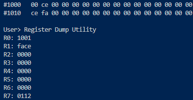
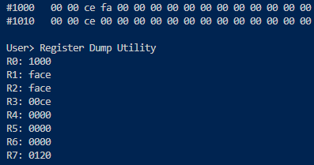
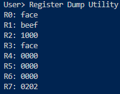
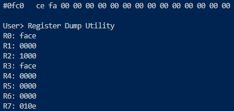
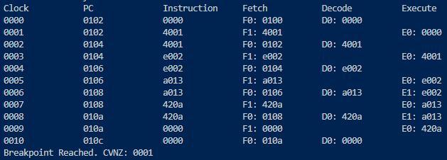

# Assignment 3 - XM23P Data Pipeline

<div style="position: absolute; top: 0; right: 0;">Zachary Fraser</div>

This assignment aims to implement the data memory access pipeline for the XM23P emulator. There are three
stages: Fetch, Decode, and Execute. In this assignment, the Execute stage is extended to allow for data
memory access in a similar manner to the instruction memory access seen in the fetch stage.

The following instructions were implemented:

1) Store
2) Load
3) Store Relative
4) Load Relative

## Design

The design contains logic flowcharts detailing the CPU Loop, and the Fetch, Decode, and Execute Stages.  A Data dictionary describing the instructions and register file is also included.


<!-- Page Break -->
<div style="page-break-after: always;"></div>


<!-- Page Break -->
<div style="page-break-after: always;"></div>


<!-- Page Break -->
<div style="page-break-after: always;"></div>


<!-- Page Break -->
<div style="page-break-after: always;"></div>

### Data Dictionary

```  PSEUDOCODE
IMEM            =   32*2^10{WORD}32*2^10
IMAR            =   ADDRESS
ICTRL           =   [READ|WRITE]
IMBR            =   WORD
IR              =   WORD

DMEM            =   64*2^10{BYTE}64*2^10
DMAR            =   ADDRESS
DCTRL           =   [READ|WRITE]
DMBR            =   WORD

REGFILE         =   3{GPR}3 + BP + LR + SP + PC
GPR             =   WORD *General Purpose Register*
BP              =   WORD *Base Pointer*
LR              =   WORD *Link Register*
SP              =   WORD *Stack Pointer*
PC              =   WORD *Program Counter*

PSW             =   PRV_PRI + 4{DC}4 + FLT + CUR_PRI + V + SLP + N + Z + C
PRV_PRI         =   3{BIT}3 *Previous Priority*
DC              =   BIT     *Don't Care*
FLT             =   BIT     *Fault*
CUR_PRI         =   3{BIT}3 *Current Priority*
V               =   BIT     *Arithmetic overflow*
SLP             =   BIT     *Sleep State*
N               =   BIT     *Negative Result*
Z               =   BIT     *Zero Result*
C               =   BIT     *Carry*

BREAKPOINT      =   ADDRESS
START_ADDRESS   =   ADDRESS

INSTRUCTION     =   CODE + 1{PARAMETER}4
CODE            =   [0-20] *Contiguous encoding of instructions*
PARAMETER       =   [RC|WB|SOURCE|DESTINATION|BYTE]

RC              =   BIT
WB              =   BIT
SOURCE          =   3{BIT}3
DESTINATION     =   3{BIT}3
READ            =   0x0000
WRITE           =   0x0001

ADDRESS         =   WORD
WORD            =   2{BYTE}2
BYTE            =   8{BIT}8
BIT             =   [0|1]
```

<!-- Page Break -->
<div style="page-break-after: always;"></div>

## Testing

The following tests were implemented:

- Test_28: Store Instructions
- Test_29: Load Instructions
- Test_30: Data Hazard Bubble
- Test_31: Negative Offsets
- Test_32: Execute Pipeline

Each test may be run from a powershell terminal with the following command:

``` powershell
Get-Content '.\Path\To\Input\File' | '.\Path\To\Executable'
```

<!-- Page Break -->
<div style="page-break-after: always;"></div>

### Test_28: Store Instructions

#### Purpose

Verify store and store relative instructions correctly add data to data memory.

#### Configuration

.\tests\Execute_Tests\Input_Files\Test28.in

1) Test28_Store.xme was loaded into the emulator.
2) `b 112` was entered to set a breakpoint at address `#0112`
3) `g` was entered to run the program
4) `m 1 1000 1020` was entered to dump the data memory between address `1000` and `1020`.
5) `r` was entered to dump the CPU register contents.

#### Expected Results

`#00CE` should be at data memory addresses `#1000`.\
`#FACE` should be stored at data memory address `#1010`.
`#1001` should be stored in Register `R0`.

#### Results

The memory and register contents correctly matched:\


#### Pass/Fail

Pass.

<!-- Page Break -->
<div style="page-break-after: always;"></div>

### Test_29: Load Instructions

#### Purpose

Verify load and load relative instructions correctly retrieve data from data memory.

#### Configuration

.\tests\Execute_Tests\Input_Files\Test29.in

1) Test29_Load.xme was loaded into the emulator.
2) `b 120` was entered to set a breakpoint at address `#0120`
3) `g` was entered to run the program
4) `m 1 1000 1020` was entered to dump the data memory between address `1000` and `1020`.
5) `r` was entered to dump the CPU register contents.

#### Expected Results

The CPU registers should be as follows:

``` Pseudocode
R0: 1000
R1: FACE
R2: FACE
R3: 00CE
R4: 0000
R5: 0000
R6: 0000
R7: 0120
```

`#FACE` should be stored at `#1002`\
`#00CE` should be stored at `#1012`

#### Results

The register and memory contents correctly matched:\


#### Pass/Fail

Pass.

<!-- Page Break -->
<div style="page-break-after: always;"></div>

### Test_30: Data Hazard Bubble

#### Purpose

Verify that a data hazard bubble is inserted when a load instruction changes the program counter.

#### Configuration

.\tests\Execute_Tests\Input_Files\Test30.in

1) Test30_DataHazard.xme was loaded into the emulator.
2) `b 202` was entered to set a breakpoint at address `#0202`
3) `g` was entered to run the program
4) `r` was entered to dump the CPU register contents.

#### Expected Results

The CPU registers should be as follows:

``` Pseudocode
R0: FACE
R1: BEEF
R2: 1000
R3: FACE
R4: 0000
R5: 0000
R6: 0000
R7: 0202
```

#### Results

The register contents correctly matched:\


#### Pass/Fail

Pass.

<!-- Page Break -->
<div style="page-break-after: always;"></div>

### Test_31: Negative Offsets

#### Purpose

Verify that negative offsets are correctly handled in load and store relative instructions.

#### Configuration

.\tests\Execute_Tests\Input_Files\Test31.in

1) Test31_NegativeOffsets.xme was loaded into the emulator.
2) `b 10E` was entered to set a breakpoint at address `#010E`
3) `g` was entered to run the program
4) `m 1 0FC0 0FD0` was entered to dump the data memory between address `0FC0` and `0FD0`.
5) `r` was entered to dump the CPU register contents.

#### Expected Results

The value `#FACE` should be loaded into Register `R3`.\
The value `#FACE` should be stored at data memory address `#0FC0`

#### Results

The register and memory contents correctly matched:\


#### Pass/Fail

Pass.

<!-- Page Break -->
<div style="page-break-after: always;"></div>

### Test_32: Execute 1 Pipeline

#### Purpose

Verify that the pipeline executes E1 stage only for data memory accesses.

#### Configuration

.\tests\Execute_Tests\Input_Files\Test32.in

1) Test32_Execute1Pipeline.xme was loaded into the emulator.
2) `b 10A` was entered to set a breakpoint at address `#010A`
3) `d` was entered to enable debug mode
4) `g` was entered to run the program

#### Expected Results

Instructions at PC = 100 and 106 should not have an E1 stage.\
Instructions at PC = 102 and 104 should have an E1 stage.

#### Results

The pipeline debug statements showed the correct stages for each instruction:\


#### Pass/Fail

Pass.
