# Assignment 2 - XM23P Instruction Pipeline

<div style="position: absolute; top: 0; right: 0;">Zachary Fraser</div>

This assignment aims to implement the data memory access pipeline for the XM23P emulator.  There are three stages: Fetch, Decode, and Execute.  In this assignment, the Execute stage is extended to allow for data memory access in a similar manner to the instruction memory access seen in the fetch stage.

## Design

The design contains logic flowcharts detailing the CPU Loop, and the Fetch, Decode, and Execute Stages.  A Data dictionary describing the instructions and register file is also included.


<!-- Page Break -->
<div style="page-break-after: always;"></div>


<!-- Page Break -->
<div style="page-break-after: always;"></div>



<!-- Page Break -->
<div style="page-break-after: always;"></div>


<!-- Page Break -->
<div style="page-break-after: always;"></div>

### Data Dictionary

``` Pseduocode
INSTRUCTION     =   CODE + 1{PARAMETER}4
CODE            =   [0-20] *Contiguous encoding of instructions*
PARAMETER       =   [RC|WB|SOURCE|DESTINATION|BYTE]

RC              =   BIT
WB              =   BIT
SOURCE          =   3{BIT}3
DESTINATION     =   3{BIT}3

IMEM            =   32*2^10{WORD}32*2^10
IMAR            =   ADDRESS
ICTRL           =   [READ|WRITE]
IMBR            =   WORD
IR              =   WORD

ADDRESS         =   WORD
READ            =   0x0000
WRITE           =   0x0001
WORD            =   2{BYTE}2
BYTE            =   8{BIT}8
BIT             =   [0|1]
```

## Testing

The following tests were implemented:

- Test_17: Register Initialization
- Test_18: Addition
- Test_19: Decimal Addition
- Test_20: Swap Instructions
- Test_21: Swap Byte Instructions
- Test_22: Sign Extend Instructions
- Test_23: Addition PSW

<!-- Page Break -->
<div style="page-break-after: always;"></div>

### Test_17: Register Initialization

#### Purpose

Test the loading of a byte from instruction to CPU register.

#### Configuration

.\tests\Execute_Tests\Input_Files\Test17.in

1) Test17_Register_Initialization.xme was loaded into the emulator.
2) `b 104` was entered to set a breakpoint at address `#0104`
3) `g` was entered to run the program
4) `r` was entered to dump the CPU registers

#### Expected Results

The registers should hold these values:\
R0: abcd\
R1: 0000\
R2: 0000\
R3: 0000\
R4: 0000\
R5: 0000\
R6: 0000\
R7: 0104

#### Results

The register contents correctly matched:\


#### Pass/Fail

Pass.

<!-- Page Break -->
<div style="page-break-after: always;"></div>

### Test_18: Addition

#### Purpose

Test addition instructions.

#### Configuration

.\tests\Execute_Tests\Input_Files\Test18.in

1) Test18_Addition.xme was loaded into the emulator.
2) `b 10a` was entered to set a breakpoint at address `#010a`
3) `g` was entered to run the program
4) `r` was entered to dump the CPU registers

#### Expected Results

The registers should hold these values:\
R0: abcd\
R1: abcd\
R2: 0000\
R3: 0000\
R4: 0000\
R5: 0000\
R6: 0000\
R7: 010a

#### Results

The register contents correctly matched:\


#### Pass/Fail

Pass.

<!-- Page Break -->
<div style="page-break-after: always;"></div>

### Test_19: Decimal Addition

#### Purpose

Test the decimal addition instruction.

#### Configuration

.\tests\Execute_Tests\Input_Files\Test19.in

1) Test19_Decimal_Addition.xme was loaded into the emulator.
2) `b 10a` was entered to set a breakpoint at address `#010a`
3) `g` was entered to run the program
4) `r` was entered to dump the CPU registers

#### Expected Results

The registers should hold these values:\
R0: 9999\
R1: 0000\
R2: 0001\
R3: 0000\
R4: 0000\
R5: 0000\
R6: 0000\
R7: 010a

#### Results

The register contents correctly matched:\


#### Pass/Fail

Pass.

<!-- Page Break -->
<div style="page-break-after: always;"></div>

### Test_20: Swap Instructions

#### Purpose

Test the swap and mov instructions.

#### Configuration

.\tests\Execute_Tests\Input_Files\Test20.in

1) Test20_Swap_Instructions.xme was loaded into the emulator.
2) `b 10a` was entered to set a breakpoint at address `#010a`
3) `g` was entered to run the program
4) `r` was entered to dump the CPU registers

#### Expected Results

The registers should hold these values:\
R0: 0001\
R1: 9999\
R2: 9999\
R3: 0000\
R4: 0000\
R5: 0000\
R6: 0000\
R7: 010a

#### Results

The register contents correctly matched:\


#### Pass/Fail

Pass.

<!-- Page Break -->
<div style="page-break-after: always;"></div>

### Test_21: Swap Byte Instructions

#### Purpose

Test the swap byte instructions.

#### Configuration

.\tests\Execute_Tests\Input_Files\Test21.in

1) Test21_Swap_Byte_SignExtend.xme was loaded into the emulator.
2) `b 10a` was entered to set a breakpoint at address `#010a`
3) `g` was entered to run the program
4) `r` was entered to dump the CPU registers

#### Expected Results

The registers should hold these values:\
R0: cdab\
R1: ff80\
R2: 0000\
R3: 0000\
R4: 0000\
R5: 0000\
R6: 0000\
R7: 010a

#### Results

The register contents correctly matched:\


#### Pass/Fail

Pass.

<!-- Page Break -->
<div style="page-break-after: always;"></div>

### Test_22: Sign Extend Instructions

#### Purpose

Test the sign extend instructions.

#### Configuration

.\tests\Execute_Tests\Input_Files\Test22.in

1) Test21_Swap_Byte_SignExtend.xme was loaded into the emulator.
2) `b 10a` was entered to set a breakpoint at address `#010a`
3) `g` was entered to run the program
4) `r` was entered to dump the CPU registers

#### Expected Results

The registers should hold these values:\
R0: cdab\
R1: ff80\
R2: 0000\
R3: 0000\
R4: 0000\
R5: 0000\
R6: 0000\
R7: 010a

#### Results

The register contents correctly matched:\


#### Pass/Fail

Pass.

<!-- Page Break -->
<div style="page-break-after: always;"></div>

### Test_23: Addition PSW

#### Purpose

Test the setting of PSW bits.

#### Configuration

.\tests\Execute_Tests\Input_Files\Test23.in

1) Test23_Addition_PSW.xme was loaded into the emulator.
2) `b 108` was entered to set a breakpoint at address `#0108`
3) `g` was entered to run the program
4) `r` was entered to dump the CPU registers
2) `b 10a` was entered to set a breakpoint at address `#010a`
3) `g` was entered to run the program
4) `r` was entered to dump the CPU registers

#### Expected Results

- On the first pass the following bits should be set: Overflow, Carry, Zero
- On the second pass the following bits should be set: Negative

<!-- Page Break -->
<div style="page-break-after: always;"></div>

#### Results

The PSW bits correctly matched on each pass:\


#### Pass/Fail

Pass.

<!-- Page Break -->
<div style="page-break-after: always;"></div>
