# Assignment 2 - XM23P Instruction Pipeline

<div style="position: absolute; top: 0; right: 0;">Zachary Fraser</div>

This assignment aims to implement the instruction pipeline for an XM23P emulator.  

## Design

The design contains logic flowcharts detailing the execution of each branch instruction.  A Data dictionary describing the instructions, PSW, and register file is also included.



<!-- Page Break -->
<div style="page-break-after: always;"></div>

### Data Dictionary

``` Pseduocode
INSTRUCTION     =   CODE + 1{PARAMETER}4
CODE            =   [0-20] *Contiguous encoding of instructions*
PARAMETER       =   [RC|WB|SOURCE|DESTINATION|BYTE]

RC              =   BIT
WB              =   BIT
SOURCE          =   3{BIT}3
DESTINATION     =   3{BIT}3

IMEM            =   32*2^10{WORD}32*2^10
IMAR            =   ADDRESS
ICTRL           =   [READ|WRITE]
IMBR            =   WORD
IR              =   WORD

ADDRESS         =   WORD
READ            =   0x0000
WRITE           =   0x0001
WORD            =   2{BYTE}2
BYTE            =   8{BIT}8
BIT             =   [0|1]
```

## Testing

The following tests were implemented:

- Test_XX: Test One Name
- Test_XX: Test Two Name
- Test_XX: Test Three Name

<!-- Page Break -->
<div style="page-break-after: always;"></div>

### Test_XX: Test One Name

#### Purpose

Test description.

#### Configuration

.\tests\Execute_Tests\Input_Files\TestXX.in

1) TestXX_Test_File.xme was loaded into the emulator.
2) `b xxxx` was entered to set a breakpoint at address `#xxxx`
3) `g` was entered to run the program
4) `m d xxxx yyyy` was entered to dump the data memory between address xxxx and yyyy.

#### Expected Results

Expected Results

#### Results

The register contents correctly matched:\


#### Pass/Fail

Pass.

<!-- Page Break -->
<div style="page-break-after: always;"></div>