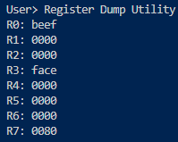
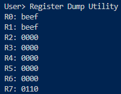
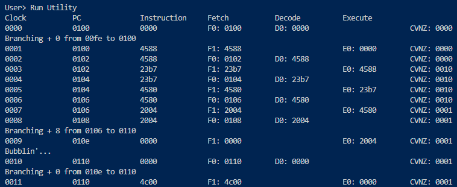
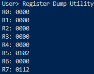

# Assignment 4 - XM23P Branch Instructions

<div style="position: absolute; top: 0; right: 0;">Zachary Fraser</div>

This assignment aims to bring branching instructions to the emulator.  This will allow for more control in changing flow of control of programs.

## Testing

The following tests were implemented:

- [Test 33: Branch True](#test-33-branch-true)
- [Test 34: Branch False](#test-34-branch-false)
- [Test 35: Bubble](#test-35-bubble)
- [Test 36: Link Branch](#test-36-link-branch)
- [Test 37: NOOP Branch](#test-37-noop-branch)

Each test may be run from a powershell terminal with the following command:

``` powershell
Get-Content '.\Path\To\Input\File' | '.\Path\To\Executable'
```

<!-- Page Break -->
<div style="page-break-after: always;"></div>

### Test 33: Branch True

#### Purpose

Ensure the branch instruction correctly branches when the condition is met.

#### Configuration

.\tests\Execute_Tests\Input_Files\Test33.in

1) Test33_Branch_True.xme was loaded into the emulator.
2) `b 80` was entered to set a breakpoint at address `#0080`.
3) `d` was entered to enable debug mode.
4) `g` was entered to run the program.
5) `r` was entered to view the register contents.

#### Expected Results

`R1`, `R2` should not contain `#BEEF`.\
`R3` should contain `#FACE`

#### Results

The register contents correctly matched:\


#### Pass/Fail

Pass.

<!-- Page Break -->
<div style="page-break-after: always;"></div>

### Test 34: Branch False

#### Purpose

Ensure the branch instruction correctly skips the branch when the condition is not met.

#### Configuration

.\tests\Execute_Tests\Input_Files\Test34.in

1) Test34_Branch_False.xme was loaded into the emulator.
2) `b 110` was entered to set a breakpoint at address `#0110`.
3) `d` was entered to enable debug mode.
3) `g` was entered to run the program.
4) `r` was entered to view the register contents.

#### Expected Results

Only `R0` and `R1` should contain `#BEEF`.\
`R3` Should not contain `#FACE`.

#### Results

The register contents correctly matched:\


#### Pass/Fail

Pass.

<!-- Page Break -->
<div style="page-break-after: always;"></div>

### Test 35: Bubble

#### Purpose

Verify the branch instruction correctly adds a bubble when a branch is taken, and does not add a bubble when the branch is not taken.

#### Configuration

.\tests\Execute_Tests\Input_Files\Test35.in

1) Test35_Bubble.xme was loaded into the emulator.
2) `b 112` was entered to set a breakpoint at address `#0112`.
3) `d` was entered to enable debug mode.
3) `g` was entered to run the program.

#### Expected Results

A bubble should not be inserted when the condition of the first branch is not met at `#0102`.\
A bubble should be inserted when the condition of the second branch is met at `#0106`.

#### Results

The pipeline bubbled as expected:\


#### Pass/Fail

Pass.

<!-- Page Break -->
<div style="page-break-after: always;"></div>

### Test 36: Link Branch

#### Purpose

Ensure the Link Register receives the correct address when a branch with link instruction is executed.

#### Configuration

.\tests\Execute_Tests\Input_Files\Test36.in

1) Test36_Link_Branch.xme was loaded into the emulator.
2) `b 112` was entered to set a breakpoint at address `#0112`.
3) `d` was entered to enable debug mode.
3) `g` was entered to run the program.
4) `r` was entered to view the register contents.

#### Expected Results

The Link Register `R5` should contain `#0102`

#### Results

The register contents correctly matched:\


#### Pass/Fail

Pass.

### Test 37: NOOP Branch

#### Purpose

Ensure a bubble is not inserted when a branch would not result in out of order execution.

#### Configuration

.\tests\Execute_Tests\Input_Files\Test37.in

1) Test37_NOOP_Branch.xme was loaded into the emulator.
2) `b 110` was entered to set a breakpoint at address `#0110`.
3) `d` was entered to enable debug mode.
3) `g` was entered to run the program.

#### Expected Results

No bubbles should be inserted.

#### Results

No bubbles were inserted:\


#### Pass/Fail

Pass.
