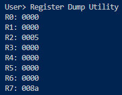

# Assignment 5 - Conditional Execution

<div style="position: absolute; top: 0; right: 0;">Zachary Fraser</div>

This assignment aims to implement conditional execution of instructions other than branches using the CEX instruction.  This will allow the XM23P to execute conditional code in a way that is less expensive than branching.

## Design

The design contains logic flowcharts detailing the conditional execution.  A Data dictionary describing the instructions, PSW, and register file is also included.


<!-- Page Break -->
<div style="page-break-after: always;"></div>

### Data Dictionary

```  PSEUDOCODE
IMEM            =   32*2^10{WORD}32*2^10
IMAR            =   ADDRESS
ICTRL           =   [READ|WRITE]
IMBR            =   WORD
IR              =   WORD
DMEM            =   64*2^10{BYTE}64*2^10
DMAR            =   ADDRESS
DCTRL           =   [READ|WRITE]
DMBR            =   WORD

REGFILE         =   3{WORD}3 + BP + LR + SP + PC
BP              =   WORD *Base Pointer*
LR              =   WORD *Link Register*
SP              =   WORD *Stack Pointer*
PC              =   WORD *Program Counter*

PSW             =   PRV_PRI + 4{DC}4 + FLT + CUR_PRI + V + SLP + N + Z + C
PRV_PRI         =   3{BIT}3 *Previous Priority*
DC              =   BIT     *Don't Care*
FLT             =   BIT     *Fault*
CUR_PRI         =   3{BIT}3 *Current Priority*
V               =   BIT     *Arithmetic overflow*
SLP             =   BIT     *Sleep State*
N               =   BIT     *Negative Result*
Z               =   BIT     *Zero Result*
C               =   BIT     *Carry*

START_ADDRESS   =   ADDRESS

INSTRUCTION     =   CODE + 1{PARAMETER}4
CODE            =   [0-20] *Contiguous encoding of instructions*
PARAMETER       =   [RC|WB|SOURCE|DESTINATION|BYTE|T_COUNT|F_COUNT|CONDITION_CODE]

RC              =   BIT
WB              =   BIT
SOURCE          =   3{BIT}3
DESTINATION     =   3{BIT}3

T_COUNT         =   [0-7]           *Number of instructions to execute if condition is true*
F_COUNT         =   [0-7]           *Number of instructions to execute if condition is false*
CONDITION_CODE  =   [#0000 - #1111] *Corresponds to execution condition*

ADDRESS         =   WORD
WORD            =   2{BYTE}2
BYTE            =   8{BIT}8
BIT             =   [0|1]
```

## Testing

The following tests were implemented:

- [Test 38: True Condition](#test-38-true-condition)
- [Test 39: False Condition](#test-39-false-condition)
- [Test 40: No True False](#test-40-no-true-false)
- [Test 41: Branch](#test-41-branch)

Each test may be run from a powershell terminal with the following command:

``` powershell
Get-Content '.\Path\To\Input\File' | '.\Path\To\Executable'
```

<!-- Page Break -->
<div style="page-break-after: always;"></div>

### Test 38: True Condition

#### Purpose

Verify that the correct instructions are executed when the condition is true.

#### Configuration

.\tests\Execute_Tests\Input_Files\Test38.in

1) Test38_True_Condition.xme was loaded into the emulator.
2) `b 10a` was entered to set a breakpoint at address `#010a`
3) `d` was entered to enabled Debug Mode
4) `g` was entered to run the program
5) `r` was entered to dump the registers.

#### Expected Results

`R0` and `R1` should both be incremented to `#0000`.\
Values of `#FFFF` and `FFFE` indicate incorrect conditional execution.

#### Results

The register contents correctly matched:\


#### Pass/Fail

Pass.

<!-- Page Break -->
<div style="page-break-after: always;"></div>

### Test 39: False Condition

#### Purpose

Verify that the correct instructions are executed when the condition is false.

#### Configuration

.\tests\Execute_Tests\Input_Files\Test39.in

1) Test39_False_Condition.xme was loaded into the emulator.
2) `b 10a` was entered to set a breakpoint at address `#010a`
3) `d` was entered to enabled Debug Mode
4) `g` was entered to run the program
5) `r` was entered to dump the registers.

#### Expected Results

`R0` and `R1` should both be incremented to `#FFFE`.\
Values of `#FFFF` and `0000` indicate incorrect conditional execution.

#### Results

The register contents correctly matched:\


#### Pass/Fail

Pass.

<!-- Page Break -->
<div style="page-break-after: always;"></div>

### Test 40: No True False

#### Purpose

Ensure that control passes to the next instruction without bubbling if both True and False counts are zero.

#### Configuration

.\tests\Execute_Tests\Input_Files\Test40.in

1) Test40_No_True_False.xme was loaded into the emulator.
2) `b 10c` was entered to set a breakpoint at address `#010c`
3) `d` was entered to enabled Debug Mode
4) `g` was entered to run the program
5) `r` was entered to dump the registers.

#### Expected Results

Registers `R0` and `R1` should both contain `#0001`.

#### Results

The register contents correctly matched:\


#### Pass/Fail

Pass.

<!-- Page Break -->
<div style="page-break-after: always;"></div>

### Test 41: Branch

#### Purpose

Ensure the conditional execution state is reset whenever a branch is taken.

#### Configuration

.\tests\Execute_Tests\Input_Files\Test41.in

1) Test41_CEX_Branch.xme was loaded into the emulator.
2) `b 8a` was entered to set a breakpoint at address `#008a`
3) `d` was entered to enabled Debug Mode
4) `g` was entered to run the program
5) `r` was entered to dump the registers.

#### Expected Results

`R2` should contain `#0005`.\
If `R0` holds a value other than `#0000` an issue occurred with the conditional execution.

#### Results

The register contents correctly matched:\


#### Pass/Fail

Pass.
