# Lab 1 Report - Zachary Fraser B00863025
# Design
**Data Dictionary**
```
ARRAY POINTER = 2{BYTE}2
LIMIT = 2{BYTE}2
VALUE = 2{BYTE}2
SUM = 2{BYTE}2
INDEX = 2{BYTE}2

BYTE = 8{BIT}8
BIT = [0|1]
```



<div style="page-break-after: always;"></div>

# Testing
Six tests were designed for the program:
1) Limit 0 Test
2) Limit Within Range Test
3) Limit Outside Range Test
4) Limit 0xFFFF Test
5) Sum of Five 0xFFFF Test

## 1. Limit 0 Test
### Purpose
This test aims to ensure that no array members are added when the limit is 0.
### Expectation
The sum should be zero, and the program should not loop.
### Configuration

### Result
Pass - The sum was 0, and the Loop Index did not increment


R1 = Loop Index\
R3 = Sum

<div style="page-break-after: always;"></div>

## 2. Limit Within Range Test
### Purpose
This test aims to ensure that the program correctly adds all numbers up to the limit.
### Expectation
The sum should be 14 (0x000E) as this is the sum of the first three array members.
### Configuration

### Result
Pass - The sum was 000E, and the Loop Index indicated three loops.


R1 = Loop Index\
R3 = Sum

<div style="page-break-after: always;"></div>

## 3. Limit Outside Range Test
### Purpose
This test aims to demonstrate that the program will continue to sum memory outside of the array.
### Expectation
The sum should be 0x0011, as this is the sum of ```2 + 4 + 8 + 2 + 1```.
### Configuration

### Result
Pass - The sum was 0011 as expected, and the Loop Index indicated that it looped 7 times.


R1 = Loop Index\
R3 = Sum

<div style="page-break-after: always;"></div>

## 4. Limit 0xFFFF Test
### Purpose
This test aims to show that 0xFFFF is evaluated as -1, and will not sum any members as it is <= 0
### Expectation
The sum should be zero, and the program should not loop.
### Configuration

### Result
Pass - The sum was 0, and the Loop Index did not increment


R0 = Loop Index\
R3 = Sum

<div style="page-break-after: always;"></div>

## 5. Sum of Five 0xFFFF Test
### Purpose
This test aims to demonstrate overflow during addition.
### Expectation
The sum should be 0xFFFB as the carry bit is lost on every addition
### Configuration

### Result
Pass - The sum was FFFB, and the Loop Index incremented 5 times


R0 = Loop Index\
R3 = Sum