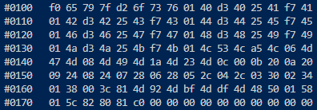
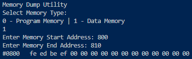
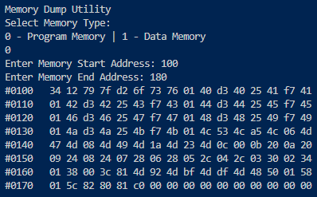
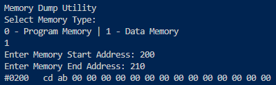
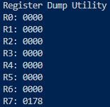
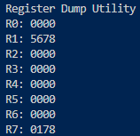
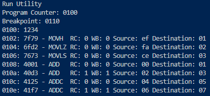

# Lab 3 - Debugging Utilities
<div style="position: absolute; top: 0; right: 0;">Zachary Fraser</div>

This lab implements several debugging utilities to the XM23P Emulator: 
- Memory Read/Write 
- Register Read/Write
- Breakpoint Insertion  
## Design
The design contains logic flowcharts detailing the implementation of a more robust "operating system", as well as the utilities.\
A Data Dictionary for the current state of the emulator is included.




<!-- Page Break -->
<div style="page-break-after: always;"></div>


<!-- Page Break -->
<div style="page-break-after: always;"></div>


<!-- Page Break -->
<div style="page-break-after: always;"></div>


<!-- Page Break -->
<div style="page-break-after: always;"></div>


<!-- Page Break -->
<div style="page-break-after: always;"></div>



<!-- Page Break -->
<div style="page-break-after: always;"></div>


<!-- Page Break -->
<div style="page-break-after: always;"></div>

**Data Dictionary**
``` 
PROGRAM         =   IMEM + DMEM + REGFILE + BREAKPOINT + START_ADDRESS + IR

IMEM            =   64*2^10{BYTE}64*2^10
DMEM            =   64*2^10{BYTE}64*2^10

REGFILE         =   8{WORD}8
BREAKPOINT      =   ADDRESS
START_ADDRESS   =   ADDRESS
IR              =   WORD

INSTRUCTION     =   CODE + 1{PARAMETER}4
CODE            =   [0-20] *Contiguous encoding of instructions*
PARAMETER       =   [RC|WB|SOURCE|DESTINATION|BYTE]

RC              =   BIT
WB              =   BIT
SOURCE          =   3{BIT}3
DESTINATION     =   3{BIT}3

ADDRESS         =   WORD
WORD            =   2{BYTE}2
BYTE            =   8{BIT}8
BIT             =   [0|1]

S_REC           =   'S' + REC_TYPE + LENGTH + ADDRESS + DATA
REC_TYPE        =   ['0'|'1'|'2'|'9']
LENGTH          =   BYTE_PAIR
ADDRESS         =   2{BYTE_PAIR}2
DATA            =   1{BYTE_PAIR}30
BYTE_PAIR       =   2{CHAR}2
CHAR            =   ['0'-'F']
```

<!-- Page Break -->
<div style="page-break-after: always;"></div>

## Testing
The following tests were implemented:
- Test_10: Instruction Memory Dump
- Test_11: Data Memory Dump
- Test_12: Instruction Memory Write
- Test_13: Data Memory Write
- Test_14: Register Dump
- Test_15: Register Set
- Test_16: Breakpoint Set

### Test_10: Instruction Memory Dump
**Purpose**\
Test the printing of memory from instruction memory.\
**Configuration**
1) Test10_Program_Debugging.xme was loaded into the emulator.
2) `m` was entered to start the Memory Dumping Utility.
3) `0` was entered to select Instruction Memory.
4) Start Address of `0x0100` was entered.
5) End Address of `0x0180` was entered.

**Expected Results**\
The program should print the contents of memory between address `#0100` and `#0180`.\
**Results**\
The contents were correctly printed:\
\
**Pass/Fail**\
Pass.

<!-- Page Break -->
<div style="page-break-after: always;"></div>

### Test_11: Data Memory Dump
**Purpose**\
Test the printing of memory from data memory.\
**Configuration**
1) Test10_Program_Debugging.xme was loaded into the emulator.
2) `m` was entered to start the Memory Dumping Utility.
3) `1` was entered to select Data Memory.
3) Start Address of `0x0800` was entered.
4) End Address of `0x0810` was entered.

**Expected Results**\
The program should print the contents of memory between address `#0800` and `#0810`.\
**Results**\
The contents were correctly printed:\
\
**Pass/Fail**\
Pass.

<!-- Page Break -->
<div style="page-break-after: always;"></div>

### Test_12: Instruction Memory Write
**Purpose**\
Test the writing of memory to instruction memory.\
**Configuration**
1) Test10_Program_Debugging was loaded into the emulator.
2) `w` was entered to start the Memory Writing Utility.
3) `0` was entered to select Instruction Memory.
4) Start Address of `0x0100` was entered.
5) Data `0x1234` was entered.
6) `m` was entered to start the Memory Dumping Utility.
7) `0` was entered to select Instruction Memory.
8) Start Address of `0x0100` was entered.
9) End Address of `0x0180` was entered.

**Expected Results**\
The program should write the data `0x1234` to memory address `#0100`.\
**Results**\
The data was successfully written to memory in little endian format:\
\
**Pass/Fail**\
Pass.

<!-- Page Break -->
<div style="page-break-after: always;"></div>

### Test_13: Data Memory Write
**Purpose**\
Test the writing of memory to data memory.\
**Configuration**
1) Test10_Program_Debugging was loaded into the emulator.
2) `w` was entered to start the Memory Writing Utility.
3) `1` was entered to select Data Memory.
4) Start Address of `0x0200` was entered.
5) Data `0xABCD` was entered.
6) `m` was entered to start the Memory Dumping Utility.
7) `1` was entered to select Data Memory.
8) Start Address of `0x0200` was entered.
9) End Address of `0x0210` was entered.

**Expected Results**\
The program should write the data `0xABCD` to memory address `#0200`.\
**Results**\
The data was successfully written to memory in little endian format:\
\
**Pass/Fail**\
Pass.

<!-- Page Break -->
<div style="page-break-after: always;"></div>

### Test_14: Register Dump
**Purpose**\
Test the printing of register values.\
**Configuration**
1) Test10_Program_Debugging was loaded into the emulator.
2) `g` was entered to run the program and load the Program Counter.
3) `r` was entered to start the Register Dumping Utility.

**Expected Results**\
The program should print the values of all registers, the program counter (register 7) should hold a non-zero value.\
**Results**\
The register values were correctly printed:\
\
**Pass/Fail**\
Pass.

<!-- Page Break -->
<div style="page-break-after: always;"></div>

### Test_15: Register Set
**Purpose**\
Test the setting of register values.\
**Configuration**
1) Test10_Program_Debugging was loaded into the emulator.
2) `s` was entered to start the Register Setting Utility.
3) Register `1` was selected.
4) Data `0x5678` was entered.
5) `r` was entered to start the Register Dumping Utility.

**Expected Results**\
The program should set the value of register `R1` to `0x5678`.\
**Results**\
The value of register `R1` was successfully set:\
\
**Pass/Fail**\
Pass.

<!-- Page Break -->
<div style="page-break-after: always;"></div>

### Test_16: Breakpoint Set
**Purpose**\
Test the setting of breakpoints.\
**Configuration**
1) Test10_Program_Debugging was loaded into the emulator.
2) `b` was entered to start the Breakpoint Setting Utility.
3) Breakpoint address `0x0110` was entered.
4) `g` was entered to Run the program.

**Expected Results**\
The program should set a breakpoint at address `0x0110`, and execution should stop at this point.\
**Results**\
The breakpoint was successfully set, and execution stopped at `0x0110`:\
\
**Pass/Fail**\
Pass