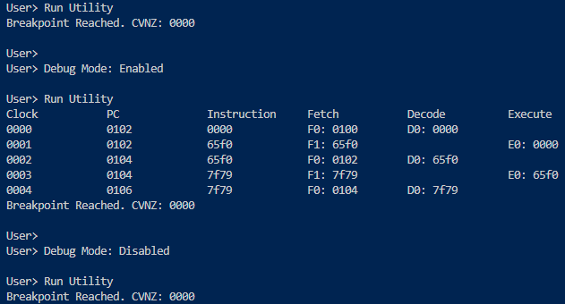
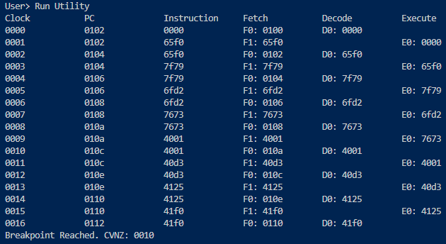
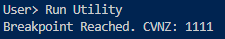
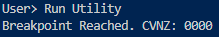

# Lab 3 - Debugging Utilities

<div style="position: absolute; top: 0; right: 0;">Zachary Fraser</div>

This lab implements condition code manipulation and debug printing to the XM23P Emulator.

## Design

The design contains logic flowcharts detailing the implementation of the condition code and debug features.\
A Data Dictionary for the current state of the emulator is included.


<div></div>

<!-- Page Break -->
<div style="page-break-after: always;"></div>

<div></div>

<!-- Page Break -->
<div style="page-break-after: always;"></div>

### Data Dictionary

```  PSEUDOCODE
PROGRAM         =   IMEM + DMEM + REGFILE + BREAKPOINT + START_ADDRESS + IR

IMEM            =   64*2^10{BYTE}64*2^10
DMEM            =   64*2^10{BYTE}64*2^10

REGFILE         =   3{GPR}3 + BP + LR + SP + PC
GPR             =   WORD *General Purpose Register*
BP              =   WORD *Base Pointer*
LR              =   WORD *Link Register*
SP              =   WORD *Stack Pointer*
PC              =   WORD *Program Counter*

PSW             =   PRV_PRI + 4{DC}4 + FLT + CUR_PRI + V + SLP + N + Z + C
PRV_PRI         =   3{BIT}3 *Previous Priority*
DC              =   BIT     *Don't Care*
FLT             =   BIT     *Fault*
CUR_PRI         =   3{BIT}3 *Current Priority*
V               =   BIT     *Arithmetic overflow*
SLP             =   BIT     *Sleep State*
N               =   BIT     *Negative Result*
Z               =   BIT     *Zero Result*
C               =   BIT     *Carry*

BREAKPOINT      =   ADDRESS
START_ADDRESS   =   ADDRESS
IR              =   WORD

INSTRUCTION     =   CODE + 1{PARAMETER}4
CODE            =   [0-20] *Contiguous encoding of instructions*
PARAMETER       =   [RC|WB|SOURCE|DESTINATION|BYTE]

RC              =   BIT
WB              =   BIT
SOURCE          =   3{BIT}3
DESTINATION     =   3{BIT}3

ADDRESS         =   WORD
WORD            =   2{BYTE}2
BYTE            =   8{BIT}8
BIT             =   [0|1]

S_REC           =   'S' + REC_TYPE + LENGTH + ADDRESS + DATA
REC_TYPE        =   ['0'|'1'|'2'|'9']
LENGTH          =   BYTE_PAIR
ADDRESS         =   2{BYTE_PAIR}2
DATA            =   1{BYTE_PAIR}30
BYTE_PAIR       =   2{CHAR}2
CHAR            =   ['0'-'F']
```

<!-- Page Break -->
<div style="page-break-after: always;"></div>

## Testing

The following tests were implemented:

- Test_24: Debug Toggle
- Test_25: Pipeline Printing
- Test_26: Set Condition Codes
- Test_27: Clear Condition Codes

Each test may be run from a powershell terminal with the following command:

``` powershell
Get-Content '.\Path\To\Input\File' | '.\Path\To\Executable'
```

### Test_24: Debug Toggle

**Purpose**\
Test the functionality of the debug toggle feature in the XM23P Emulator.\
**Configuration**

.\tests\Debug_Tests\Input_Files\test24.in

1) Test10_Program_Debugging.xme was loaded into the emulator.
2) The program was executed without enabling the debug mode.
3) The debug toggle was activated after program execution.
4) The program was executed with debug mode enabled.
5) The debug toggle was deactivated after program execution.
6) The program was executed with debug mode disabled.

**Expected Results**\
The first and third executions of the program should not display debug information.  The second execution should display debug information.\
**Results**\
The debug toggle successfully enabled and disabled the debug mode.\



**Pass/Fail**\
Pass.

<!-- Page Break -->
<div style="page-break-after: always;"></div>

### Test_25: Pipeline Printing

**Purpose**\
Test the pipeline printing functionality in the XM23P Emulator.\
**Configuration**

.\tests\Debug_Tests\Input_Files\test25.in

1) Test10_Program_Debugging.xme was loaded into the emulator.
2) The debug toggle was activated using `d`.
3) A breakpoint was set at address `0110` using `b 110`
4) The program was executed using `g`.

**Expected Results**\
The pipeline printing should display the stages of the pipeline during program execution.  During the first clock cycle, stages F0 and D0 should run, and during the second clock cycle F1 and E0 should run.  The program counter should increment after every second clock tick.\
**Results**\
The pipeline printing successfully displayed the stages of the pipeline as expected.\



**Pass/Fail**\
Pass.

<!-- Page Break -->
<div style="page-break-after: always;"></div>

### Test_26: Set Condition Codes

**Purpose**\
Test the functionality of the setcc instruction in the XM23P Emulator.\
**Configuration**

.\tests\Execute_Tests\Input_Files\test26.in

1) Test26_Condition_Codes.xme was loaded into the emulator.
2) A breakpoint was set at address `0102` using `b 102`
3) The program was executed using `g`.

**Expected Results**\
The condition codes should be correctly set based on the executed instructions.\
**Results**\
The condition codes were correctly set based on the executed instructions as expected.\



**Pass/Fail**\
Pass.

<!-- Page Break -->
<div style="page-break-after: always;"></div>

### Test_27: Clear Condition Codes

**Purpose**\
Test the functionality of the clrcc instruction in the XM23P Emulator.\
**Configuration**

.\tests\Execute_Tests\Input_Files\test27.in

1) Test26_Condition_Codes.xme was loaded into the emulator.
2) A breakpoint was set at address `0104` using `b 104`
3) The program was executed using `g`.

**Expected Results**\
The condition codes should be cleared based on the executed instructions.\
**Results**\
The condition codes were cleared based on the executed instructions as expected.\



**Pass/Fail**\
Pass.
